# 🏗️ MEP & Architectural Renovation Brief: Proposal 1

## Overview: Current → Proposed

**Full renovation.** All floors demolished and re-laid — tile quantities needed.

> **Approach:** Some changes can be reconsidered and done later if needed — deferring is harder and costlier after construction, but the budget must be protected.

| Current | → | Proposed |
|---|---|---|
| 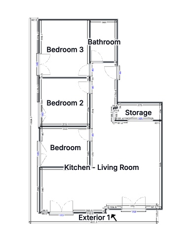 | | 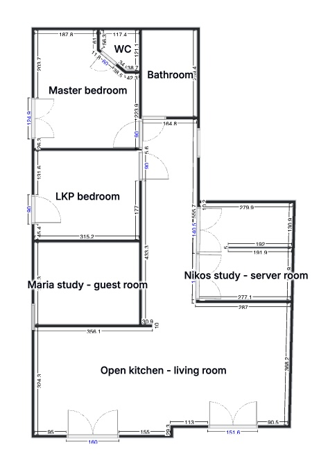 |

## 1. Demolition & Wall Additions

| Change | Detail | Image |
|---|---|---|
| Shift kitchen–study wall | Kitchen bigger, study smaller — **beam-dependent** (see pending #12) | 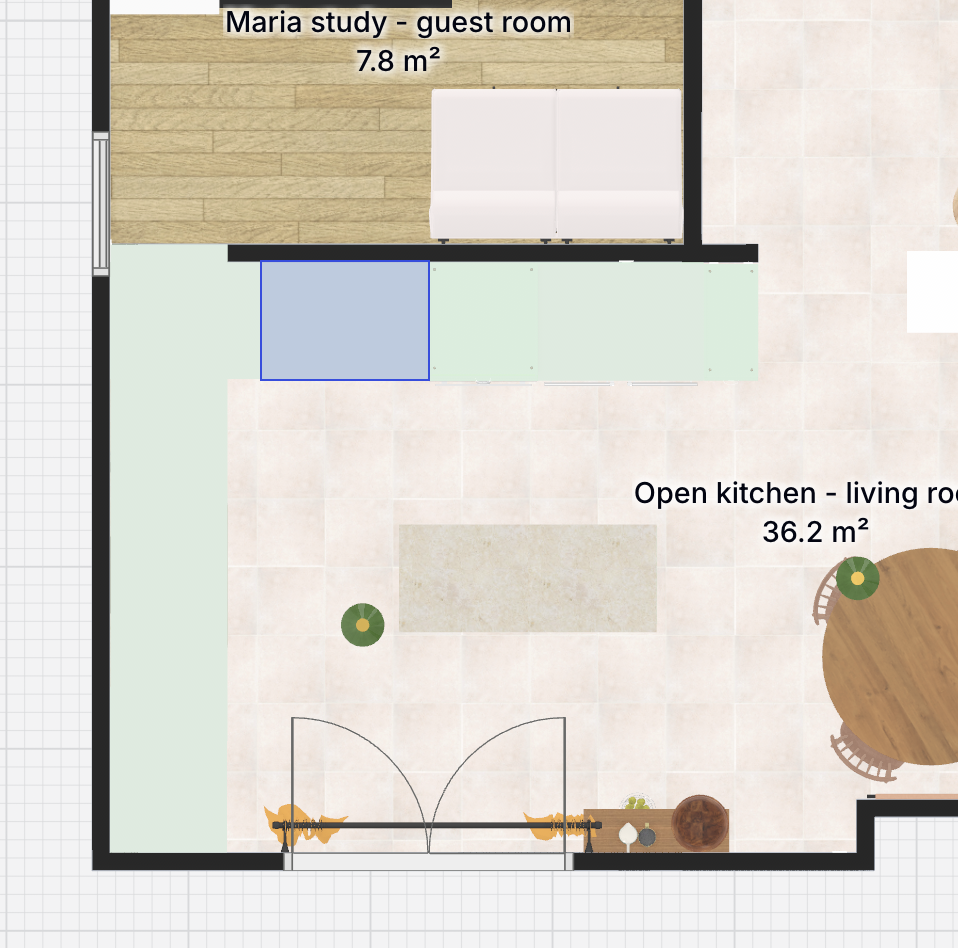 |
| Demolish east storage partition | Expand Nikos study/server room | 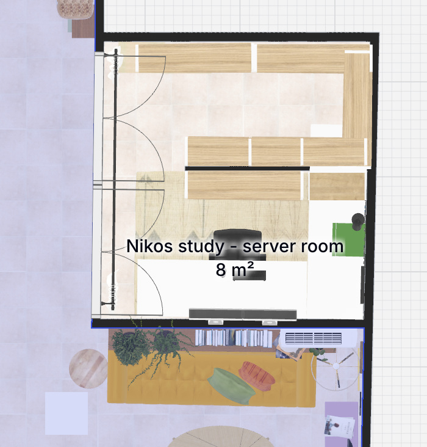 |
| Construct WC in master bedroom | New drywall partition | 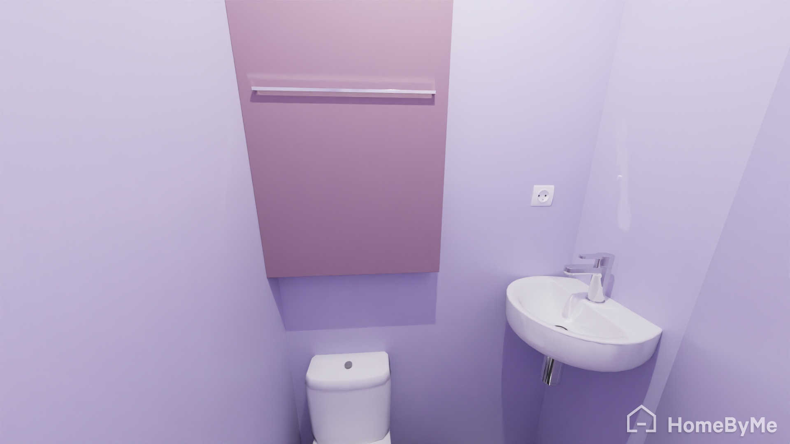 |
| Strip bathroom walls | Full strip incl. electrical panel area | |
| Loft above bathroom | Probably demolish — method agreed by engineer + demo contractor, to re-explain; solar (ηλιακός) pipes pass through — what happens to them? | |
| Demolish small hole | For WC bathroom ventilation | |
| Marble | Tiles over existing marble (selective removal only where needed — electrician/plumber) OR complete marble demolition — **decision** (see pending #11) | |
| Remove ceiling wall decorations | | |
| Remove marble sills | Under window frames, balcony side | |
| Remove skirting boards & curtain rods | | |
| Remove wood floor | Comes out regardless | |
| Remove entire kitchen | | |
| Kitchen–Maria's-room wall | Comes down — **beam-dependent**: if δοκάρι in that wall, no point (beam mid-room, blocks cabinet doors) | |
| Remove AC units | | |
| Remove awnings (τέντες) | Leaning now | |
| Radiators | Lines removed, bodies kept — cleaned off-site; τσιμεντοκονία where lines ran | |
| Radiators — offices | To be added in both studies | |
| Conduits (σπιράλ) & switches | Who strips — electrician or Yiannis? (pending #16) | |
| Plumber channels low in wall | No big demo; marble drilled locally | |
| Balcony door — living room | +30 cm; kitchen door possible too — cost/effort/permits | |
| Current furniture (couches/wardrobes, previous owners) | Contractor removes — not kitchen-related | |
| Add small drywall in Leo's room | So child gate sits further in, not directly at the door | |
| Glass doors to studies | Maria's & Nikos' offices get glass doors → no wall there: Nikos (from scratch) skip the drywall; Maria (existing) demolish the front wall. Consult engineers first | |
| Study window | Adjacent to wall being moved → **Option A**: into kitchen / **Option B**: slide right along exterior | 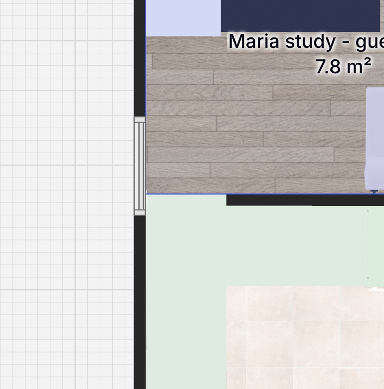 |

## 2. Kitchen Area

### Plumbing & Mechanical

| Task | Detail | Image |
|---|---|---|
| Water supply lines | Baseboard chases / drywall partition; shut-off valve each fixture | |
| Two under-counter appliances + sink | Share west wall wet stack; cover panels to conceal & quiet | 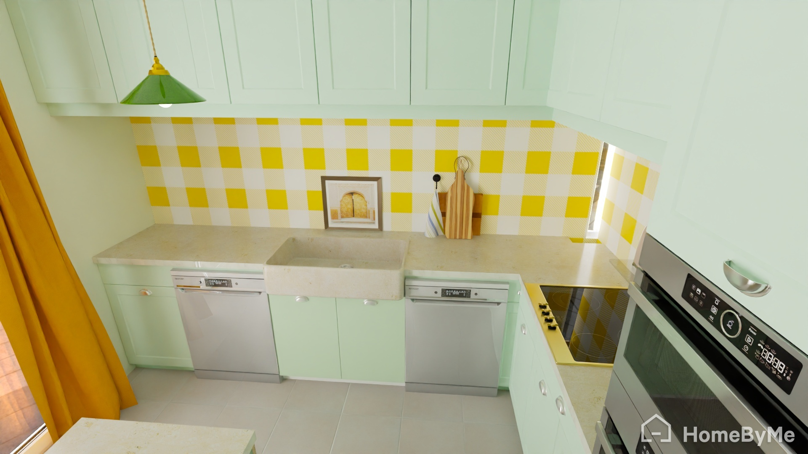 |
| Drain pipe | Ø 50 mm manifold, standpipes, anti-siphon traps | |
| Gravity slope | 1.5%–2% fall | |
| Island | No wet utilities; consider dropping island — use dinner table for prep space instead | |
| Faucet | High-arc swan-neck, pull-down spray | 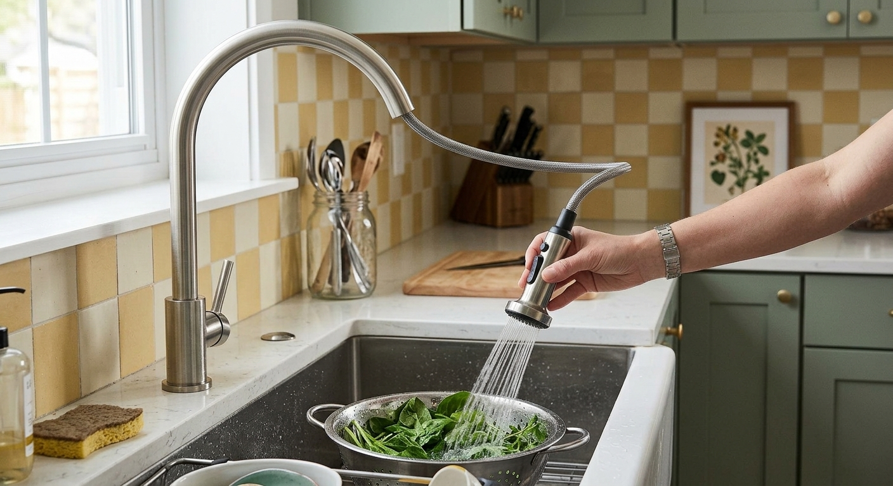 |

### Layout & Ergonomics

| Task | Detail | Image |
|---|---|---|
| Work triangle | Sink (west) ↔ cooktop (north corner) ↔ fridge/pantry (east) | 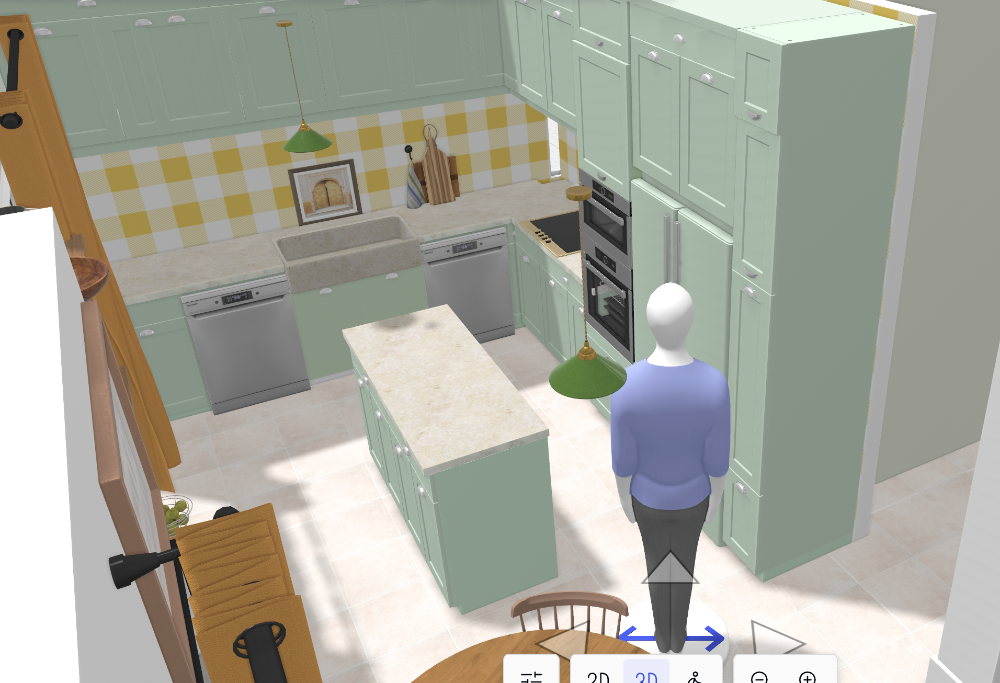 |
| Pantry | Pull-out tall cabinet right of fridge | 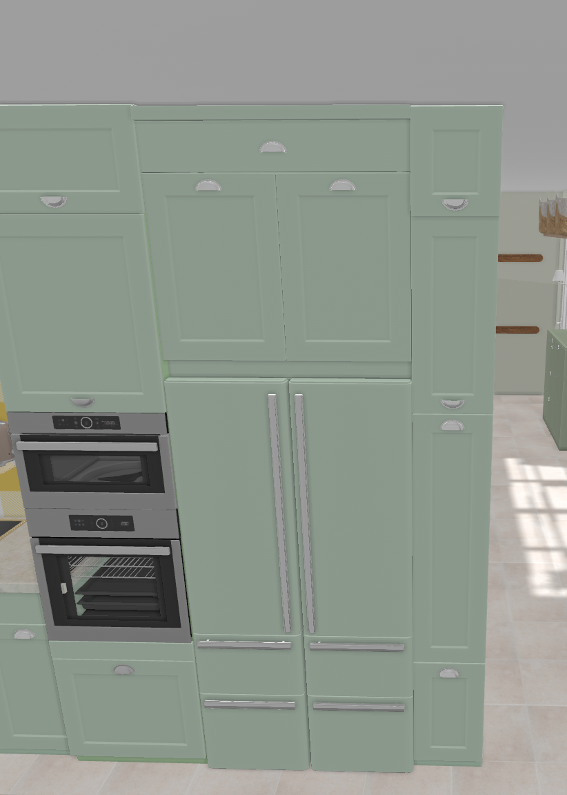 |
| Aisles | ≥ 90 cm island clearance | |
| Cooktop landing | ≥ 30 cm heat-resistant clearance from tall cabinet | |
| Appliance tower | Stacked oven + microwave beside fridge | |
| Electrical & ventilation | Dedicated circuits + rear cavity clearance | |
| Storage | Full-extension deep drawers over fixed shelves | |

### Architectural & Partition Work

| Task | Detail | Image |
|---|---|---|
| Kitchen/study boundary | Expandable partition | |
| Study window | Option A: into kitchen / Option B: relocate right along exterior |  |

### Lighting & Electrical

- [TODO]

> **Note:** Check flexible/track lights — or at least their mechanism — in case a ceiling light is not in the right spot.

## 3. Nikos Study / Server Room

| Task | Detail | Image |
|---|---|---|
| Demolish east storage wall | Expand to study/server room — details in renovation draft | |
| Drywall separator | Study + server room share the space — drywall between them as a room separator |  |
| Glass door | No windows in the room — glass door to maximize incoming light | 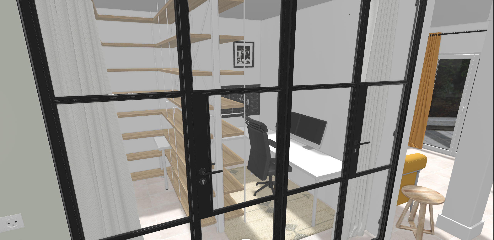 |
| Ventilation | Needed if possible | |
| Enclosure | Acoustic dampening, high-density conduits | |

## 4. Master Bedroom & En-Suite Suite

| Task | Detail | Image |
|---|---|---|
| Add new WC | Drywall partition in former Bedroom 3 zone, off the corridor adjacent to main bath | 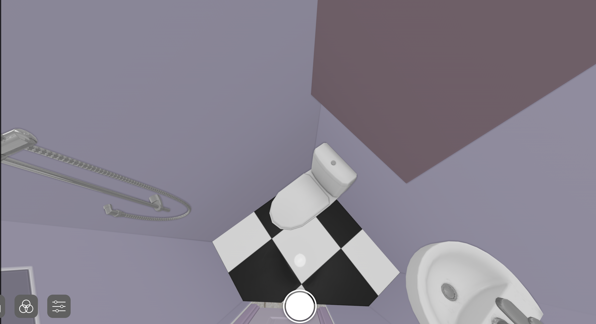 |
| WC 2D plan | | 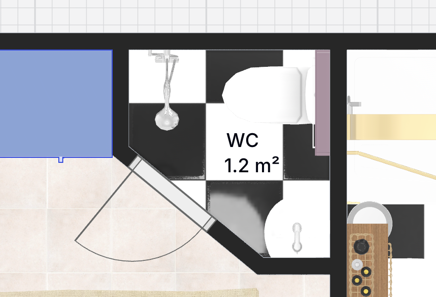 |

## 5. Main Bathroom

| Task | Detail | Image |
|---|---|---|
| Full renovation & redesign | Wet stack retained, everything else rebuilt/replanned | 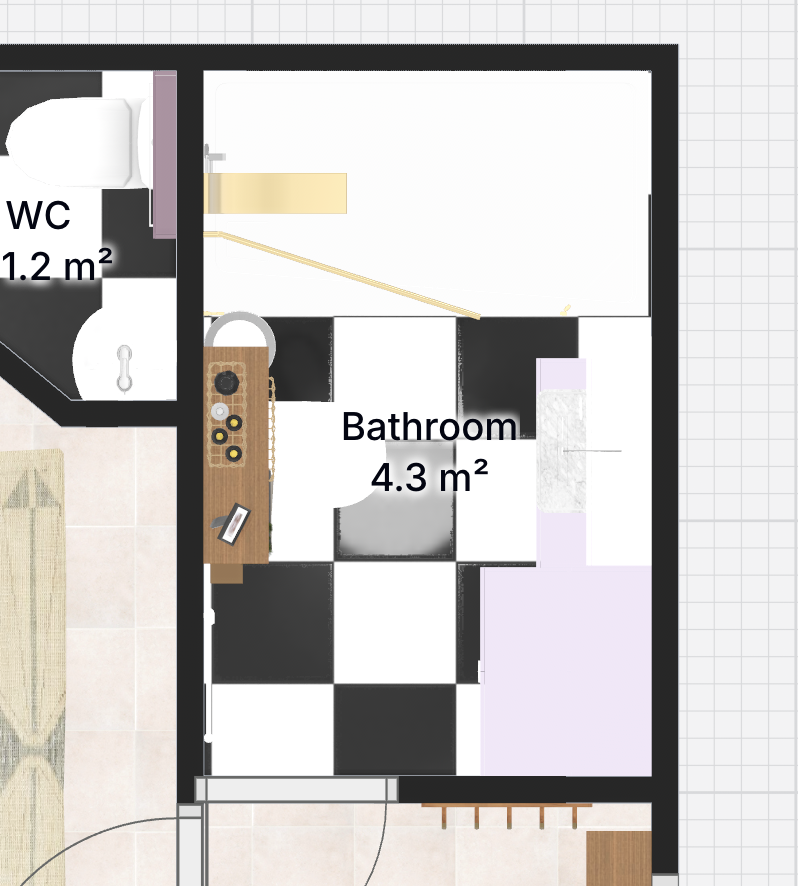 |
| Laundry | Washer in dedicated cabinet module, inside the bathroom | 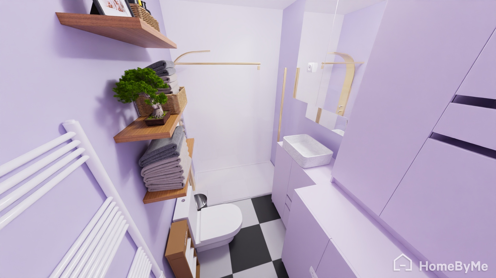 |

## 6. Flooring

| Option | Detail |
|---|---|
| New flooring | Most likely demolish all floors, re-lay new — tile quantities to spec |
| Existing wood floors | Rooms have wood flooring — explore **renovating in place** (sand/refinish) vs. replacing |

## 7. Next Steps & Pending Technical Reviews

| # | Task | Reference |
|---|---|---|
| 1 | 🔍 Floor screed check — trench depth for kitchen drains | Architectural Survey |
| 2 | 🚽 Master WC plumbing route | MEP Plan V1.2 |
| 3 | 📄 Nikos spec sync | File |
| 4 | 🪵 Wood reclamation — salvage existing kitchen wood? | Contractor / Millwork Review |
| 5 | 🤔 Countertop vs. vertical storage | Design & Layout Review |
| 6 | 🪟 Study window placement — decide (Option A/B); determines kitchen size | Design Review |
| 7 | 🪟 Windows & patio doors — may need replacement; consider mirror-like balcony door glazing so outsiders can't see in | Windows / Facade Review |
| 8 | 🎨 Painting job — likely needed; decide timing & whether we do it ourselves | Finishing / Paint Scope |
| 9 | 🧥 Built-in wardrobes — likely after renovation; need carpenter recommendation | Carpenter / Millwork |
| 10 | 🚪 Glass doors to studies — structural check for Maria's front-wall demolition & Nikos' no-wall build | Structural Engineer |
| 11 | 🧱 Marble — tiles over existing (selective removal where needed) vs. complete marble demolition: decide | Finishing / Materials |
| 12 | 🏗️ Beam check — send plans to Georgia; where is the δοκάρι? If in kitchen–Maria's wall, skip wall move & kitchen enlargement | Structural Engineer |
| 13 | 🔥 Radiators — bodies cleaned & re-installed? Offices: new or reused bodies? | Heating / MEP |
| 14 | 🪜 Loft above bathroom — re-explain agreed demo method with engineer; what about the ηλιακός pipes passing through? | Structural Engineer |
| 15 | 🚪 Balcony door +30 cm (living room) — confirm who does it (fenestration vs. demo), permits; decide kitchen door after cost review | Fenestration / Permits |
| 16 | ⚡ Conduits (σπιράλ) & switches — electrician or Yiannis strips them? | Electrical |
| 17 | 🗓️ Demolition — estimate due Mon; floor demo alone ≥ €3k; start by 20 Oct; crane left of building + neighbors OK; upload tiles/materials with demo crane; contractor can also paint walls | Demolition |
| 18 | 🔨 Tiles — start looking next week | Materials |
| 19 | 🚿 WC ventilation — confirm the small hole scope | MEP |